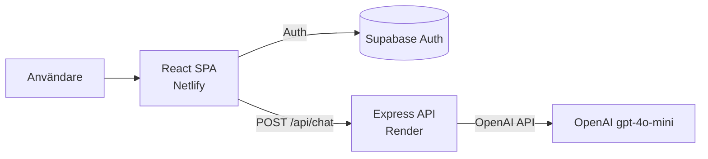

# ChatFlow

En modern chattapp med AI-assistent, byggd som fullstack-portföljprojekt. Användare kan registrera sig, logga in, eller **prova appen direkt som gäst** — och chatta med AI-botten Patrik i realtid.

**Live demo:** [chatflowv2.netlify.app](https://chatflowv2.netlify.app)

---

## Vad appen gör

ChatFlow är en single-page-app där inloggade användare (eller gäster) kan ha en konversation med en AI-assistent. Appen hanterar autentisering, skyddad routing, responsiv layout och säker proxying av AI-anrop via en egen backend.

| Funktion | Beskrivning |
|---|---|
| **Registrering & inloggning** | E-post/lösenord via Supabase Auth |
| **Prova som gäst** | Anonym inloggning — perfekt för den som vill testa utan konto |
| **AI-chatt** | Konversation med Patrik (OpenAI `gpt-4o-mini`) |
| **Konversationsminne** | Senaste 3 meddelanden skickas som kontext (token-optimerat) |
| **Responsiv design** | Fungerar på desktop och mobil (inkl. viewport-fix för mobila webbläsare) |
| **Säkerhet** | API-nycklar på servern, CSP, input-sanering, CORS |

---

## Tech stack

### Frontend
- **React 18** + **Vite**
- **React Router** — client-side routing med skyddade routes
- **CSS (custom)** — mörkt UI med design tokens, flex-layout, `100dvh` för mobil
- **DOMPurify** — sanering av användarinput
- **Bootstrap / React Bootstrap** — komponenter där det passar

### Backend
- **Node.js** + **Express** — REST API (`POST /api/chat`)
- **OpenAI SDK** — AI-svar via `gpt-4o-mini`
- **CORS** — tillåter endast frontend-domäner

### Auth & infrastruktur
- **Supabase Auth** — registrering, inloggning, anonym gästinloggning
- **Netlify** — frontend-hosting (SPA)
- **Render** — backend-hosting

---

## Arkitektur



**Varför en egen backend?** OpenAI API-nyckeln får aldrig exponeras i webbläsaren. Frontend anropar `/api/chat` via `VITE_API_URL`; backend vidarebefordrar anropet till OpenAI med `OPENAI_API_KEY` från servermiljön.

---

## Säkerhet & best practices

- **API-nyckel på servern** — `OPENAI_API_KEY` ligger i Render, inte i frontend-bundle
- **Content Security Policy** — definierad i `index.html`, begränsar vilka domäner appen får anropa
- **Input-validering** — max 500 tecken per meddelande, trimmad historik, konfigurerbara `MAX_TOKENS` och `HISTORY_LIMIT`
- **CORS-whitelist** — endast localhost och produktionsdomäner
- **DOMPurify** — XSS-skydd på chat-input
- **Supabase RLS** — SQL-schema för meddelandelagring finns i `supabase/` (förberett för framtida persistens)

---

## Projektstruktur

```
ChatFlow-V2/
├── src/
│   ├── components/     # Home, Login, Register, Chat, Header
│   ├── App.jsx         # Routing & auth-state
│   ├── guestLogin.js   # Anonym inloggning (Supabase)
│   ├── supabaseClient.js
│   └── global.css      # Design system & layout
├── server/
│   └── index.js        # Express API → OpenAI
├── supabase/
│   └── messages_schema.sql   # DB-schema (körs manuellt i Supabase)
├── index.html          # CSP & entry point
├── netlify.toml        # Frontend deploy
└── .env.example        # Miljövariabler
```

---

## Kom igång lokalt

> **Snabb demo:** använd [live-versionen](https://chatflowv2.netlify.app) och klicka **Prova som gäst**. Du behöver inga API-nycklar eller lokal setup.

Lokal utveckling kräver **egna** nycklar — du delar aldrig dina riktiga värden i README eller Git. Filen `.env` är gitignorerad och committas inte.

| Variabel | Hemlig? | Kommentar |
|---|---|---|
| `VITE_SUPABASE_URL` | Nej (publik) | Projekt-URL, exponeras i frontend |
| `VITE_SUPABASE_ANON_KEY` | Nej (publik) | Supabase *anon*-nyckel — avsedd för klienten, skyddas av RLS |
| `VITE_API_URL` | Nej | Backend-URL i produktion; tom lokalt |
| `OPENAI_API_KEY` | **Ja** | Endast i `.env` / Render — aldrig i kod eller Git |

### 1. Klona och installera

```bash
git clone https://github.com/Dinolisk/ChatFlow-V2.git
cd ChatFlow-V2
npm install
```

### 2. Skapa egen `.env`

Kopiera `.env.example` till `.env` och fyll i **dina egna** värden från [Supabase Dashboard](https://supabase.com/dashboard) och [OpenAI](https://platform.openai.com/api-keys). Se `.env.example` för full lista.

I Supabase: aktivera **Anonymous Sign-Ins** under Authentication → Providers (krävs för gästknappen).

### 3. Starta appen

```bash
npm run dev:all
```

| Tjänst | URL |
|---|---|
| Frontend | http://localhost:5173 |
| Backend | http://localhost:3001 |

---

## Deploy

| Del | Plattform | Miljövariabler |
|---|---|---|
| Frontend | Netlify | `VITE_SUPABASE_URL`, `VITE_SUPABASE_ANON_KEY`, `VITE_API_URL` |
| Backend | Render | `OPENAI_API_KEY`, valfritt `MAX_TOKENS`, `HISTORY_LIMIT` |

**Render Start Command:** `node server/index.js`

---

## Testa den live

1. Öppna [chatflowv2.netlify.app](https://chatflowv2.netlify.app)
2. Klicka **Prova som gäst**
3. Skriv ett meddelande till Patrik i chatten

Ingen registrering krävs.

---

## Scripts

| Kommando | Beskrivning |
|---|---|
| `npm run dev:all` | Startar frontend + backend |
| `npm run dev` | Endast frontend |
| `npm run dev:server` | Endast backend (med auto-reload) |
| `npm run build` | Produktionsbuild för Netlify |
| `npm run lint` | ESLint |

---

## Framtida förbättringar

- [ ] Persistens av meddelanden i Supabase (`messages_schema.sql` är redan förberedd)
- [ ] Realtime-chatt mellan användare via Supabase Realtime
- [ ] Rate limiting per användare på backend

---

## Licens

Privat portföljprojekt.
